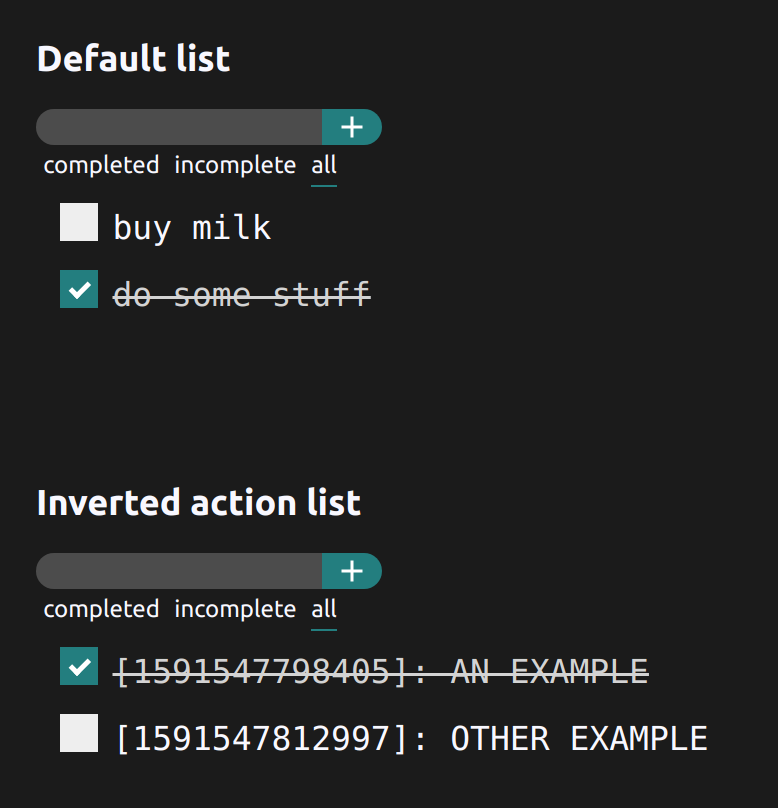

# @fefo/todo-app

> Made with create-react-library

[](https://www.npmjs.com/package/decoupled-redux) [](https://standardjs.com)

## Install

```bash
npm install --save @fefo/todo-app
```

```bash
yarn add @fefo/todo-app
```

## Usage

```tsx
import React from 'react'
import { TodoApp, TodoActions } from '@fefo/todo-app'

const App = () => {
  return (
    <>
      <TodoApp title="Default list" />

      <TodoApp
        title="Inverted action list"
        addTodo={(content: string) => {
          const id = Date.now().toString()
          return {
            type: TodoActions.ADD_TODO,
            payload: {
              id,
              content: `[${id}]: ${content.toUpperCase()}`,
              completed: true
            }
          }
        }}
      />
    </>
  )
}

export default App

```




## License

MIT © [ulisesantana](https://github.com/ulisesantana)
